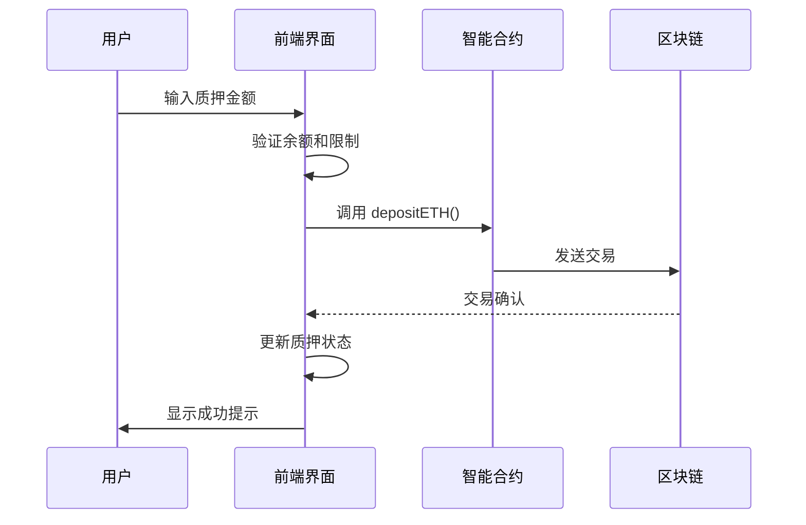
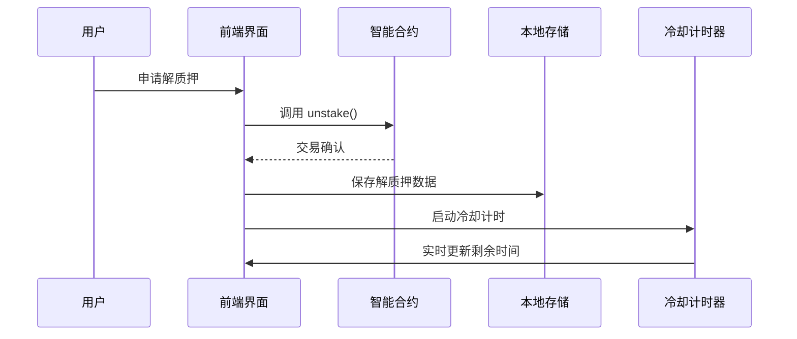
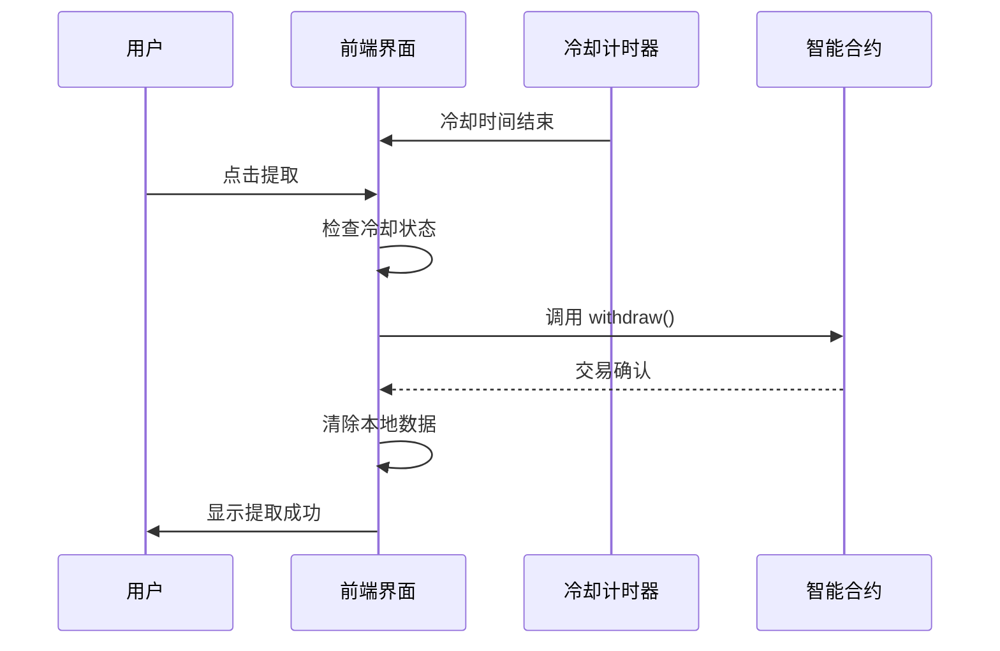

# Stake 项目技术文档

## 📋 项目概述

这是一个基于区块链的 **ETH 质押挖矿平台**，用户可以质押 ETH 来赚取 MetaNode 代币奖励。项目采用 Next.js 15 框架，集成了 RainbowKit 钱包连接和 Wagmi 区块链交互库，部署在 Sepolia 测试网上。

## 🏗️ 技术架构

### 前端技术栈
- **框架**: Next.js 15 (App Router)
- **UI 组件库**: Radix UI + Tailwind CSS + Shadcn/ui
- **区块链交互**: Viem v2.x + Wagmi v2.x + RainbowKit v2.x
- **钱包支持**: MetaMask, WalletConnect, Coinbase Wallet 等
- **状态管理**: React Hooks + React Context
- **样式方案**: Tailwind CSS + CSS-in-JS
- **类型安全**: TypeScript
- **开发工具**: ESLint, PostCSS

### 项目结构
```
my-app/
├── app/                    # Next.js App Router
│   ├── (root)/
│   │   ├── page.tsx       # 主页 - 质押界面
│   │   └── withdraw/      # 解质押页面
│   └── api/               # API 路由
├── components/            # React 组件
│   ├── ui/               # UI 基础组件
│   ├── CooldownTimer.tsx # 冷却计时器
│   └── ...
├── hooks/                # 自定义 Hooks
│   ├── useStakingContract.ts # 质押合约交互
│   └── ...
├── lib/                  # 工具库
│   ├── abi/             # 智能合约 ABI
│   └── utils.ts
└── provider/            # Context Provider
```

## 🔧 核心功能模块

### 1. 质押功能 (`useStakingContract.ts`)

#### 主要方法
```typescript
// 质押 ETH
const stakeETH = async (amount: string): Promise<TransactionResult>

// 申请解质押
const requestUnstake = async (amount: string): Promise<TransactionResult>

// 提取已解质押的 ETH
const withdrawETH = async (): Promise<TransactionResult>

// 领取奖励
const claimRewards = async (): Promise<TransactionResult>

// 刷新所有数据
const refreshData = async (): Promise<void>
```

#### 状态管理
```typescript
// 质押相关状态
const stakedAmount: string           // 已质押金额
const pendingRewards: string         // 待领取奖励
const totalStaked: string           // 总质押量
const minStakeAmount: string        // 最小质押金额

// 解质押相关状态
const requestAmount: string         // 请求解质押金额
const pendingWithdrawAmount: string // 待提取金额
const unstakeLockedBlocks: number   // 解质押锁定区块数
const withdrawPaused: boolean       // 提取是否暂停

// 冷却机制状态
const cooldownInfo: CooldownInfo    // 冷却信息
```

### 2. 智能合约交互

#### 合约信息
- **合约地址**: `0x5cE3E2e0a0d2a6E5eE5B4A6c5E5D3D3B3F3E3E3F` (代理合约)
- **网络**: Sepolia 测试网
- **代币**: MetaNode (MN)
- **池子系统**: 支持多池子质押

#### 主要合约方法
```solidity
// 质押 ETH
function depositETH() external payable

// 解质押
function unstake(uint256 poolId, uint256 amount) external

// 提取
function withdraw(uint256 poolId) external

// 领取奖励
function claim(uint256 poolId) external

// 查询质押余额
function stakingBalance(uint256 poolId, address user) external view returns (uint256)

// 查询待领取奖励
function pendingMetaNode(uint256 poolId, address user) external view returns (uint256)
```

### 3. 冷却机制 (`CooldownTimer.tsx`)

#### 核心特性
- **区块级精度**: 基于区块链区块数计算冷却时间
- **实时更新**: 监听新区块，动态更新剩余时间
- **双重数据源**: 本地存储 + 事件日志查询
- **可视化显示**: 进度条和倒计时

#### 冷却信息类型
```typescript
interface CooldownInfo {
  unstakeTime: number;           // 解质押时间戳
  unlockTime: number;            // 解锁时间戳
  remainingSeconds: number;      // 剩余秒数
  remainingBlocks: number;       // 剩余区块数
  isReady: boolean;              // 是否可以提取
  currentBlock: number;          // 当前区块号
}
```

### 4. 钱包集成

#### 支持的钱包
- MetaMask
- WalletConnect
- Coinbase Wallet
- Rainbow Wallet
- Trust Wallet

#### 钱包功能
```typescript
const { address, isConnected, balance, provider } = useWallet();
```

## ⚠️ 技术难点和解决方案

### 1. 复杂的状态管理

**挑战**: 质押、解质押、冷却、提取等多个状态需要同步管理，容易出现数据不一致。

**解决方案**:
- 使用 `useStakingContract` Hook 统一管理所有合约相关状态
- 通过 `refreshData()` 方法同步更新所有状态
- 实现状态变更的级联更新机制

```typescript
// 状态同步更新
const refreshData = useCallback(async (): Promise<void> => {
  await Promise.all([
    fetchStakedAmount(),
    fetchPendingRewards(),
    fetchTotalStaked(),
    fetchPoolInfo(),
    fetchWithdrawInfo(),
    fetchCooldownInfo()
  ]);
}, [...]);
```

### 2. 区块链数据处理

**挑战**: 处理 BigInt 类型转换、单位换算（Wei ↔ Ether）容易出错。

**解决方案**:
- 封装统一的格式化函数
- 使用 TypeScript 类型检查
- 添加数据验证逻辑

```typescript
// 格式化 Ether
const formatEther = (value: bigint): string => {
  return ethers.formatEther(value);
};

// 解析 Ether
const parseEther = (value: string): bigint => {
  return ethers.parseEther(value);
};
```

### 3. 冷却机制实现

**挑战**: 需要实时计算剩余区块数，处理跨页面状态同步，处理网络异常。

**解决方案**:

#### 本地存储机制
```typescript
const unstakeStorageUtils = {
  save: (address: string, poolId: number, data: UnstakeStorageData) => {
    localStorage.setItem(key, JSON.stringify(data));
  },
  get: (address: string, poolId: number): UnstakeStorageData | null => {
    // 获取并验证数据
  },
  remove: (address: string, poolId: number) => {
    localStorage.removeItem(key);
  }
};
```

#### 区块监听机制
```typescript
useEffect(() => {
  const unwatch = publicClient.watchBlockNumber({
    onBlockNumber: (blockNumber: bigint) => {
      // 更新冷却信息
      setCooldownInfo(prev => ({
        ...prev,
        currentBlock: Number(blockNumber),
        remainingBlocks: Math.max(0, unlockBlock - Number(blockNumber))
      }));
    }
  });

  return () => unwatch();
}, [...]);
```

### 4. 事件日志查询优化

**挑战**: 区块链历史数据查询可能超时或返回数据过大。

**解决方案**:
- 分批查询机制
- 动态调整批次大小
- 错误重试机制

```typescript
const queryLogsInBatches = async (
  client: PublicClient,
  contractAddress: string,
  eventAbi: EventAbi,
  args: any,
  fromBlock: bigint,
  toBlock: bigint | 'latest' = 'latest',
  batchSize: number = 3000
): Promise<RequestUnstakeEventLog[]> => {
  const logs: RequestUnstakeEventLog[] = [];
  let currentFromBlock = fromBlock;

  while (currentFromBlock <= latestBlock) {
    try {
      const batchLogs = await client.getLogs({
        address: contractAddress,
        event: eventAbi,
        args,
        fromBlock: currentFromBlock,
        toBlock: currentToBlock,
      });

      logs.push(...batchLogs);
      await new Promise(resolve => setTimeout(resolve, 100));
    } catch (error) {
      // 错误处理和批次大小调整
      if (errorMessage.includes('ranges over') && batchSize > 1000) {
        return queryLogsInBatches(..., Math.floor(batchSize / 2));
      }
    }

    currentFromBlock = currentToBlock + 1n;
  }

  return logs;
};
```

### 5. 异步数据同步

**挑战**: 合约状态变更后需要及时刷新前端数据，避免状态不一致。

**解决方案**:
- 交易确认后自动刷新
- 定时刷新奖励数据
- 区块监听触发更新

```typescript
// 交易后自动刷新
const result = await stakeETH(amount);
await refreshData();

// 定时刷新奖励
useEffect(() => {
  const interval = setInterval(() => {
    fetchPendingRewards();
  }, 30000);

  return () => clearInterval(interval);
}, [fetchPendingRewards]);
```

## ✨ 项目亮点和创新点

### 1. 智能冷却系统

**亮点**: 支持区块级精度的冷却时间计算

**创新特性**:
- 实时区块监听，动态更新剩余时间
- 本地存储 + 事件日志双重数据源确保可靠性
- 可视化进度条显示冷却状态
- 支持跨页面冷却状态同步

```typescript
// 冷却时间计算
const unlockBlock = unstakeBlock + unstakeLockedBlocks;
const remainingBlocks = Math.max(0, unlockBlock - currentBlockNum);
const remainingSeconds = remainingBlocks * blockTime;
```

### 2. 用户体验优化

**亮点**: 完整的交互反馈和错误处理

**创新特性**:
- 交易状态实时反馈
- Toast 通知系统
- Loading 状态和按钮禁用逻辑
- 详细的错误提示和解决建议

```typescript
// 交互反馈示例
const handleStake = async () => {
  setIsStaking(true);
  try {
    const result = await stakeETH(amount);
    toast({
      title: "质押成功",
      description: `交易哈希: ${result.hash.slice(0, 10)}...`
    });
  } catch (err) {
    toast({
      title: "质押失败",
      description: err.message,
      variant: "destructive"
    });
  } finally {
    setIsStaking(false);
  }
};
```

### 3. 数据一致性保障

**亮点**: 多层数据验证机制

**创新特性**:
- 本地存储缓存关键数据
- 异常数据检测和自动修复
- 合约数据交叉验证
- 状态变更的原子性操作

```typescript
// 数据验证示例
if (unstakeBlock > currentBlockNum + 1000000) {
  console.error('检测到异常的解质押区块号:', unstakeBlock);
  unstakeStorageUtils.remove(address, poolId);
  unstakeBlock = 0;
}
```

### 4. 开发者友好设计

**亮点**: 完善的调试工具

**创新特性**:
- `debugContract()` 函数输出详细状态
- 可折叠的调试信息面板
- 丰富的控制台日志
- 错误边界和异常捕获

```typescript
const debugContract = useCallback(async (): Promise<void> => {
  console.log('=== 合约调试信息 ===');
  console.log('合约地址:', PROXY_CONTRACT_ADDRESS);
  console.log('用户地址:', address);
  console.log('质押余额:', stakedAmount, 'ETH');
  console.log('待领取奖励:', pendingRewards, 'MetaNode');
  // ... 更多调试信息
}, [...]);
```

### 5. 安全性考虑

**亮点**: 多重安全检查机制

**创新特性**:
- 交易前余额验证
- 最小/最大质押金额限制
- 冷却时间强制执行
- 异常数据自动清理
- 合约状态实时校验

```typescript
// 安全检查示例
if (amountNum < minStakeNum) {
  throw new Error(`最小质押金额为 ${minStakeAmount} ETH`);
}

if (balanceNum < amountNum) {
  throw new Error('余额不足');
}

if (!cooldownInfo.isReady && cooldownInfo.remainingBlocks > 0) {
  throw new Error(`还需要等待 ${cooldownInfo.remainingBlocks} 个区块才能提取`);
}
```

### 6. 响应式设计

**亮点**: 移动端适配优秀

**创新特性**:
- 网格布局自适应
- 触摸友好的交互设计
- 优化的移动端显示效果
- 流畅的动画过渡

## 🔄 完整的质押流程

### 1. 质押流程


### 2. 解质押流程


### 3. 提取流程


## 📊 性能优化

### 1. 数据缓存策略
- 本地存储关键状态数据
- 智能缓存失效机制
- 分页加载历史数据

### 2. 网络请求优化
- 批量查询合约状态
- 请求去重和防抖
- 错误重试机制

### 3. 渲染优化
- React.memo 优化组件渲染
- useMemo 缓存计算结果
- useCallback 缓存函数引用

## 🛡️ 安全最佳实践

### 1. 智能合约安全
- 代理模式实现可升级性
- 重入攻击防护
- 权限控制和访问限制

### 2. 前端安全
- 输入验证和清理
- XSS 防护
- 私钥信息安全处理

### 3. 交易安全
- 交易前状态验证
- 签名数据完整性检查
- 异常交易监控

## 🚀 部署和运维

### 1. 环境配置
```bash
# 安装依赖
npm install

# 启动开发服务器
npm run dev

# 构建生产版本
npm run build

# 启动生产服务器
npm start
```

### 2. 环境变量
```env
# 合约配置
NEXT_PUBLIC_CONTRACT_ADDRESS=0x5cE3E2e0a0d2a6E5eE5B4A6c5E5D3D3B3F3E3E3F
NEXT_PUBLIC_NETWORK_ID=11155111
NEXT_PUBLIC_RPC_URL=https://sepolia.infura.io/v3/YOUR_PROJECT_ID

# 功能开关
NEXT_PUBLIC_ENABLE_ANALYTICS=true
NEXT_PUBLIC_ENABLE_DEBUG=true
```

### 3. 监控和日志
- 用户行为追踪
- 交易状态监控
- 性能指标收集
- 错误日志收集

## 📈 未来发展规划

### 1. 功能扩展
- 支持多代币质押
- 流动性挖矿功能
- DAO 治理机制
- 跨链桥支持

### 2. 技术升级
- 升级到最新版本的依赖库
- 实现更高效的区块链数据同步
- 优化移动端性能
- 增强安全防护措施

### 3. 用户体验优化
- 多语言支持
- 主题定制功能
- 更丰富的数据可视化
- 智能推荐系统

---

## 📞 联系信息

如有技术问题或合作需求，请通过以下方式联系：

- 项目地址: [GitHub Repository]
- 技术文档: [Documentation Site]
- 社区讨论: [Discord/Telegram]

---

*最后更新: 2025年10月*