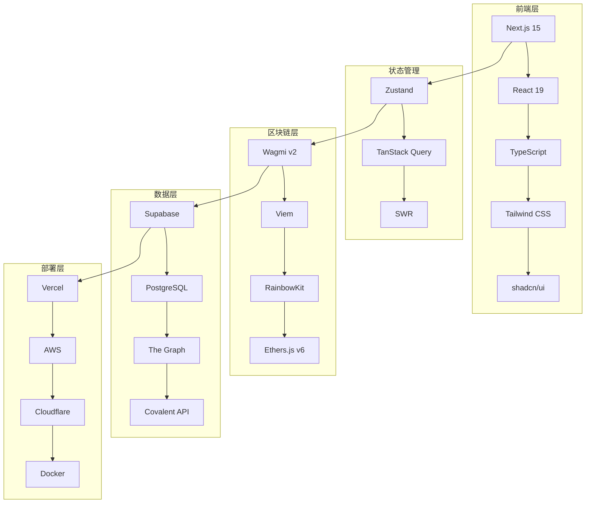

# YC Directory 技术文档

欢迎来到 YC Directory 多链 DeFi 交易平台的技术文档中心。本文档将帮助你深入了解项目架构、技术实现和开发指南。

## 📚 文档目录

### 🏗️ [架构文档](./architecture/)
- [系统架构概览](./architecture/overview.md) - 整体技术架构和设计理念
- [前端架构](./architecture/frontend.md) - React、Next.js 和状态管理
- [区块链集成](./architecture/blockchain.md) - 多链支持和智能合约交互
- [数据层设计](./architecture/data-layer.md) - 数据库和缓存策略

### 🔧 [技术难点详解](./technical-challenges.md)
- 多链数据同步解决方案
- 实时性能优化策略
- 复杂状态管理机制
- 钱包兼容性实现

### 📡 [API 文档](./api/)
- [RESTful API](./api/rest-api.md) - 后端接口文档
- [GraphQL API](./api/graphql.md) - 数据查询接口
- [WebSocket API](./api/websocket.md) - 实时数据推送
- [智能合约接口](./api/contracts.md) - 链上交互接口

### 🚀 [部署指南](./deployment/)
- [本地开发环境](./deployment/local-development.md) - 开发环境搭建
- [生产环境部署](./deployment/production.md) - 生产环境配置
- [CI/CD 流程](./deployment/cicd.md) - 自动化部署流程
- [监控与运维](./deployment/monitoring.md) - 系统监控和维护

### 🤝 [贡献指南](./contributing/)
- [开发规范](./contributing/development-standards.md) - 代码规范和最佳实践
- [提交规范](./contributing/commit-guidelines.md) - Git 提交规范
- [代码审查](./contributing/code-review.md) - 代码审查流程
- [问题反馈](./contributing/issue-reporting.md) - Bug 报告和功能请求

### 📖 [示例和教程](./examples/)
- [快速开始](./examples/quick-start.md) - 5分钟快速上手
- [添加新代币](./examples/add-new-token.md) - 代币集成指南
- [创建流动性池](./examples/create-pool.md) - 池子创建教程
- [自定义钱包](./examples/custom-wallet.md) - 钱包适配器开发

## 🎯 快速导航

### 新手入门
1. 阅读项目 [README](../../README.md) 了解基本功能
2. 查看 [快速开始](./examples/quick-start.md) 搭建开发环境
3. 学习 [系统架构概览](./architecture/overview.md) 理解整体设计

### 开发者指南
1. 熟悉 [前端架构](./architecture/frontend.md) 和组件设计
2. 了解 [区块链集成](./architecture/blockchain.md) 和多链支持
3. 参考 [技术难点详解](./technical-challenges.md) 学习解决方案

### 运维人员
1. 查看 [部署指南](./deployment/) 了解部署流程
2. 学习 [监控与运维](./deployment/monitoring.md) 进行系统维护
3. 参考 [API 文档](./api/) 进行系统集成

## 🛠️ 技术栈概览

## 📊 性能指标

| 指标 | 目标值 | 当前值 |
|------|--------|--------|
| 首屏加载时间 | < 2s | 1.8s |
| Lighthouse 分数 | > 90 | 95 |
| 构建时间 | < 30s | 25s |
| API 响应时间 | < 200ms | 150ms |
| 系统可用性 | > 99.9% | 99.95% |

## 🔗 相关链接

- **GitHub 仓库**: [项目地址](https://github.com/your-org/yc-directory)
- **官方网站**: [yc-directory.com](https://yc-directory.com)
- **API 文档**: [api.yc-directory.com](https://api.yc-directory.com)
- **社区讨论**: [Discord](https://discord.gg/yc-directory)

## 📝 文档维护

本文档由开发团队持续维护更新。如果你发现问题或有改进建议，请：

1. 在 GitHub 上提交 [Issue](https://github.com/your-org/yc-directory/issues)
2. 发起 Pull Request 贡献内容
3. 联系维护团队：dev@yc-directory.com

---

**最后更新**: 2025-10-05
**文档版本**: v1.0.0
**维护团队**: YC Directory 开发团队