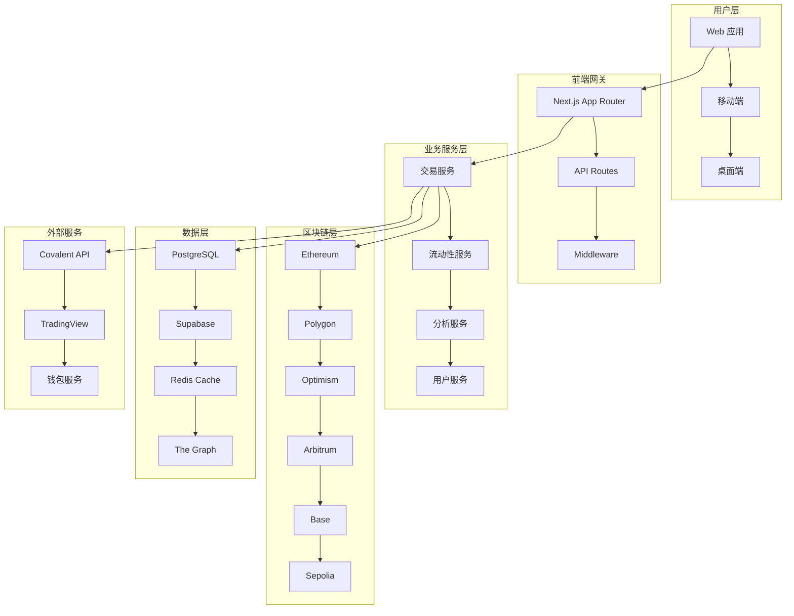
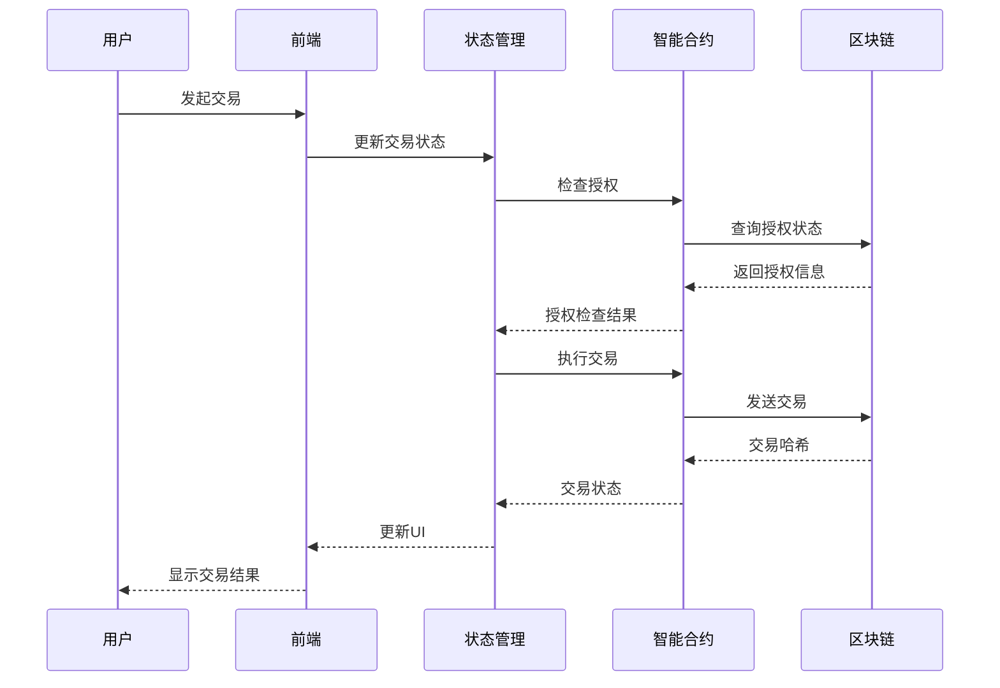
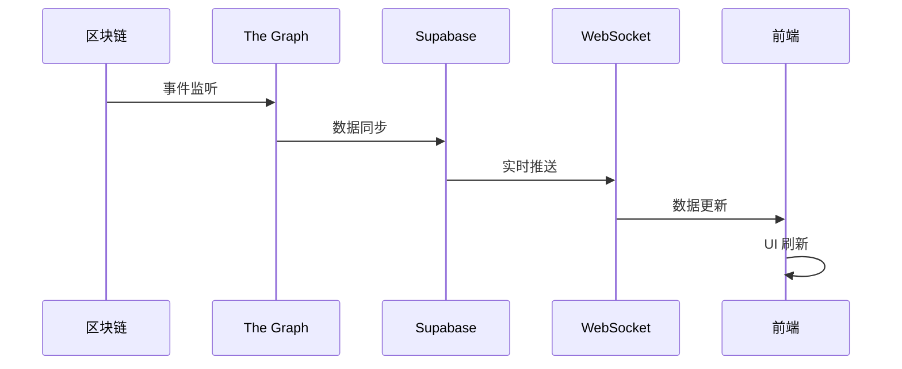

# 系统架构概览

## 📋 目录
- [架构理念](#架构理念)
- [整体架构](#整体架构)
- [核心模块](#核心模块)
- [数据流设计](#数据流设计)
- [技术选型](#技术选型)
- [性能考虑](#性能考虑)

## 🎯 架构理念

YC Directory 采用现代化的微服务架构设计，遵循以下核心原则：

### 1. 模块化设计
- **单一职责**：每个模块只负责特定功能
- **松耦合**：模块间依赖最小化
- **高内聚**：相关功能集中在同一模块

### 2. 可扩展性
- **水平扩展**：支持服务实例的动态扩容
- **垂直扩展**：支持功能模块的独立升级
- **跨链扩展**：易于添加新的区块链支持

### 3. 高可用性
- **故障隔离**：单点故障不影响整体系统
- **自动恢复**：自动检测和恢复机制
- **负载均衡**：智能流量分配

## 🏗️ 整体架构



## 🔧 核心模块

### 1. 前端应用层

#### Next.js 15 App Router
```
app/
├── (root)/                 # 根布局组
│   ├── page.tsx           # 首页 - 交易界面
│   ├── pool/              # 流动性池管理
│   ├── explore/           # 市场探索
│   ├── profile/           # 用户配置
│   └── analytics/         # 数据分析
├── api/                   # API 路由
├── globals.css           # 全局样式
└── layout.tsx            # 根布局
```

#### 组件架构
```
components/
├── ui/                   # 基础 UI 组件
├── newSwap/             # 交易组件
├── PoolTable/           # 池子表格
├── PositionsTable/      # 头寸表格
├── TradingViewWidget/   # 图表组件
└── ChainSwitcher/       # 链切换组件
```

### 2. 状态管理层

#### Zustand Store 架构
```typescript
// 全局状态结构
interface GlobalState {
  // 交易相关
  swap: SwapState;
  // 流动性相关
  liquidity: LiquidityState;
  // 用户相关
  user: UserState;
  // 应用配置
  config: ConfigState;
}
```

#### 数据获取策略
- **TanStack Query**: 服务端状态管理
- **SWR**: 实时数据同步
- **Local State**: 组件状态管理

### 3. 区块链集成层

#### Wagmi 配置
```typescript
// 多链支持配置
export const chains = [
  sepolia,     // 测试网
  mainnet,     // 以太坊主网
  polygon,     // Polygon
  optimism,    // Optimism
  arbitrum,    // Arbitrum
  base         // Base
] as const;
```

#### 智能合约交互
```typescript
// 合约调用封装
export const usePoolManagerWithClients = () => {
  const store = usePoolManagerStore();
  const { publicClient } = usePublicClient();
  const { walletClient } = useWalletClient();

  // 统一的合约调用接口
  return {
    createPool: store.createPool,
    addLiquidity: store.addLiquidity,
    removeLiquidity: store.removeLiquidity
  };
};
```

### 4. 数据持久化层

#### Supabase 集成
```typescript
// 数据库配置
export const supabase = createClient(
  process.env.NEXT_PUBLIC_SUPABASE_URL,
  process.env.NEXT_PUBLIC_SUPABASE_ANON_KEY
);

// 实时订阅
supabase
  .channel('pool_updates')
  .on('postgres_changes',
    { event: 'INSERT', schema: 'public', table: 'pools' },
    handlePoolUpdate
  )
  .subscribe();
```

## 📊 数据流设计

### 1. 交易数据流



### 2. 实时数据同步



## 🛠️ 技术选型

### 前端技术栈

| 技术 | 版本 | 用途 | 选择理由 |
|------|------|------|----------|
| Next.js | 15.5.2 | 全栈框架 | App Router、SSR/SSG、性能优化 |
| React | 19.1.0 | UI 框架 | 最新特性、生态完善 |
| TypeScript | 5.x | 类型安全 | 开发效率、代码质量 |
| Tailwind CSS | 3.4.17 | 样式框架 | 原子化 CSS、开发效率 |
| shadcn/ui | Latest | UI 组件 | 设计系统、TypeScript 支持 |

### 状态管理

| 技术 | 版本 | 用途 | 选择理由 |
|------|------|------|----------|
| Zustand | 5.0.8 | 全局状态 | 轻量级、TypeScript 友好 |
| TanStack Query | 5.87.1 | 服务端状态 | 缓存、同步、错误处理 |
| SWR | 2.3.6 | 实时数据 | 简单易用、自动重试 |

### 区块链技术

| 技术 | 版本 | 用途 | 选择理由 |
|------|------|------|----------|
| Wagmi | 2.16.9 | React Hooks | 最新标准、TypeScript 支持 |
| Viem | 2.x | 以太坊客户端 | 轻量级、性能优秀 |
| RainbowKit | 2.2.8 | 钱包连接 | 用户体验好、钱包支持全 |
| Ethers.js | 6.15.0 | 兼容性支持 | 生态成熟、文档完善 |

### 数据层技术

| 技术 | 版本 | 用途 | 选择理由 |
|------|------|------|----------|
| Supabase | Latest | 后端服务 | 实时、认证、存储一体化 |
| PostgreSQL | Latest | 主数据库 | 可靠性、扩展性 |
| Redis | Latest | 缓存 | 高性能、数据结构丰富 |
| The Graph | Latest | 索引服务 | 去中心化、查询效率高 |

## ⚡ 性能考虑

### 1. 前端性能优化

#### 代码分割策略
```typescript
// 路由级别代码分割
const PoolPage = lazy(() => import('../app/(root)/pool/page'));
const ExplorePage = lazy(() => import('../app/(root)/explore/page'));

// 组件级别代码分割
const TradingViewWidget = lazy(() => import('../components/TradingViewWidget'));
```

#### 缓存策略
```typescript
// TanStack Query 缓存配置
const queryClient = new QueryClient({
  defaultOptions: {
    queries: {
      staleTime: 5 * 60 * 1000,    // 5分钟
      cacheTime: 10 * 60 * 1000,   // 10分钟
      retry: 3,
    },
  },
});
```

### 2. 区块链性能优化

#### 批量查询
```typescript
// Multicall 减少 RPC 调用
const multicall = async (calls: Call[]) => {
  return await publicClient.multicall({
    contracts: calls,
    multicallAddress: MULTICALL_ADDRESS,
  });
};
```

#### 智能缓存
```typescript
// 本地缓存链上数据
const cache = new Map<string, any>();

const getCachedData = (key: string, fetcher: () => Promise<any>) => {
  if (cache.has(key)) {
    return cache.get(key);
  }

  const data = await fetcher();
  cache.set(key, data);
  return data;
};
```

### 3. 数据库性能优化

#### 索引策略
```sql
-- 池子表索引
CREATE INDEX idx_pools_token_pair ON pools(token0, token1);
CREATE INDEX idx_pools_fee ON pools(fee);
CREATE INDEX idx_pools_liquidity ON pools(liquidity DESC);

-- 交易表索引
CREATE INDEX idx_transactions_timestamp ON transactions(timestamp DESC);
CREATE INDEX idx_transactions_user ON transactions(user_address);
```

#### 分区策略
```sql
-- 按时间分区交易表
CREATE TABLE transactions_2024_01 PARTITION OF transactions
FOR VALUES FROM ('2024-01-01') TO ('2024-02-01');
```

## 🔮 架构演进

### 短期规划 (3-6个月)
- [ ] 实现更多 L2 链支持
- [ ] 优化移动端体验
- [ ] 增加高级图表功能
- [ ] 完善监控和告警

### 中期规划 (6-12个月)
- [ ] 微服务架构重构
- [ ] 实现跨链桥功能
- [ ] 添加 DAO 治理功能
- [ ] 支持更多钱包类型

### 长期规划 (1-2年)
- [ ] 自主链开发
- [ ] DeFi 聚合器功能
- [ ] AI 驱动的投资建议
- [ ] 全生态系统建设

---

**文档维护**: 架构团队
**最后更新**: 2025-10-05
**版本**: v1.0.0